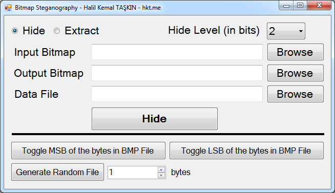

Simple Steganography Software
=============================

This solution offers a simple steganography library for Bitmap files. You can hide and extract data files into Bitmap (BMP) files with hide levels 1, 2 and 4.

Also, you can toggle MSB or LSB of bytes of bitmap files for observing the importance of bit changing. And there is a simple random file generator which allows you to generate random files at any length using .NET BCL's Random class. 

The solution is written in C# 4.0 using Visual Studio 2012 and developed as a part of the Multimedia Information Security research during the course "Applied Cryptography for Cyber Security" at [IAM, METU](http://www.iam.metu.edu.tr) in 2013.

* Here is a screenshot of the program:

